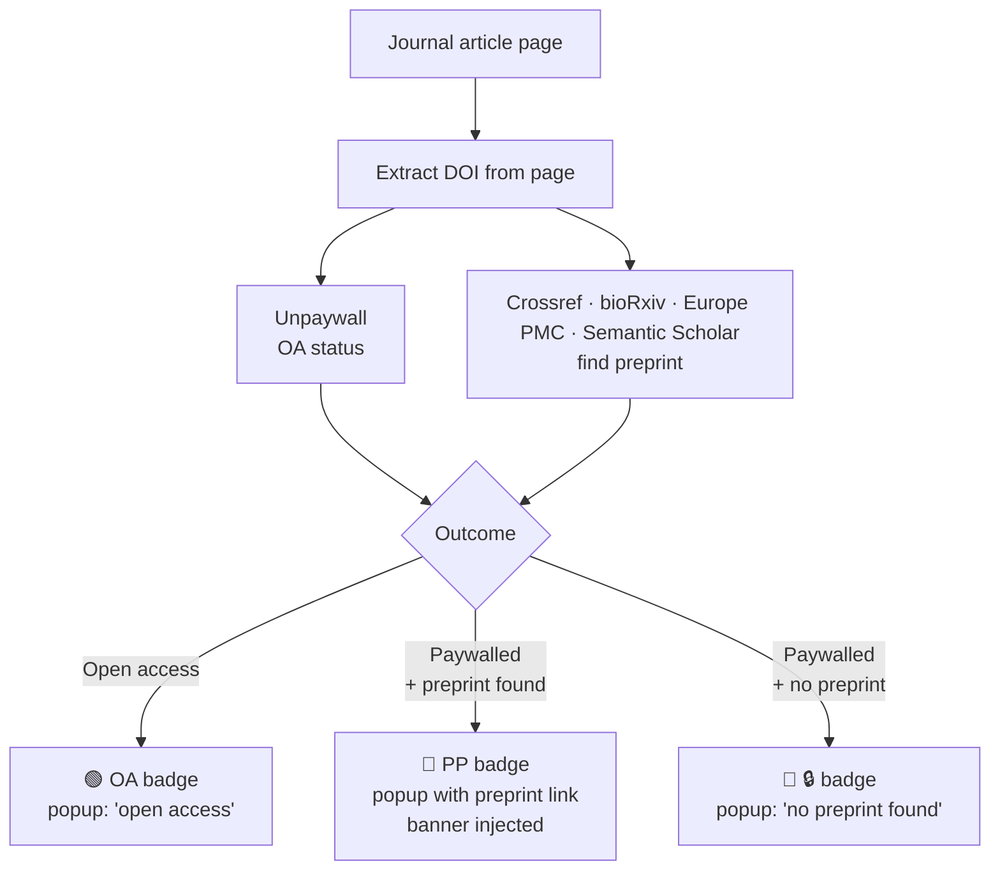

# Find Preprint

Chrome extension that detects whether a journal article you're viewing is open
access, and if not, finds a freely available preprint version (bioRxiv,
medRxiv, arXiv, ChemRxiv, Research Square, etc.).

## How it works

1. A content script extracts the article's DOI from page metadata.
2. The service worker queries an API chain in order of confidence:
   1. **Unpaywall** — OA status + any preprint URLs in `oa_locations`.
   2. **Crossref** — `is-preprint-of` / `has-preprint` relations.
   3. **bioRxiv / medRxiv** — direct published-DOI to preprint-DOI lookup.
   4. **Europe PMC** — `fullTextUrlList` and preprint comment-correction links
      (resolves `PPR####` internal ids to the real preprint DOI).
   5. **Semantic Scholar** — surfaces ArXiv ids when present.
   6. **Title fuzzy search** — Crossref `posted-content` filter, only accepted
      at Jaccard similarity > 0.85, marked "likely match".
3. Results are cached in IndexedDB for 30 days, keyed by DOI.
4. The extension badge shows OA / PP / 🔒 based on the result.
5. If the page is paywalled and a preprint was found, a slim banner is
   injected at the top of the page (dismissible per-domain for 30 days).

### Flow



### Badge states

| Badge | Meaning |
| --- | --- |
| `OA` (green) | Open access — no paywall |
| `PP` (blue) | Paywalled, preprint found |
| `🔒` (red) | Paywalled, no preprint found |
| empty | No article detected on this page |

## Install in Chrome

The extension is not yet on the Chrome Web Store, so for now it has to be
loaded manually. The process takes about a minute.

### 1. Download the code

The simplest path:

1. On the [repo page](https://github.com/rustlab1/find-preprint-extension),
   click the green **Code** button.
2. Choose **Download ZIP**.
3. Open your Downloads folder and **unzip** the file. You'll get a folder
   named `find-preprint-extension-main` (or similar). Move it somewhere you
   won't accidentally delete (e.g. `~/Documents/`). Chrome will need this
   folder to stick around as long as the extension is installed.

If you use `git`, you can `git clone https://github.com/rustlab1/find-preprint-extension.git` instead.

### 2. Open Chrome's extensions page

In a new Chrome tab, type `chrome://extensions` and press Enter. (You can also
get there via the three-dot menu in the top right: **Extensions → Manage
Extensions**.)

### 3. Turn on Developer mode

In the top-right corner of the extensions page, flip the **Developer mode**
toggle to **on**. Three new buttons appear: *Load unpacked*, *Pack
extension*, *Update*.

> Developer mode is needed because the extension hasn't been published to the
> Chrome Web Store yet. It's a standard step, not a security risk for code
> you trust.

### 4. Load the extension

1. Click **Load unpacked**.
2. In the file picker, navigate to and select the **unzipped folder** from
   step 1. Pick the folder itself, not a file inside it. The folder you
   choose must contain `manifest.json` directly.
3. The Find Preprint card should now appear on the extensions page.

### 5. Pin the icon (recommended)

Chrome hides extension icons by default. To keep Find Preprint visible:

1. Click the **puzzle-piece icon** to the right of the address bar.
2. Find **Find Preprint** in the list.
3. Click the **pin icon** next to it. The Find Preprint icon now stays in
   the toolbar.

### 6. Try it

Open one of the [test pages](#test-pages-to-try) below. Within a second or
two you should see the toolbar icon update with a small badge:

- **OA** (green) → the article is open access
- **PP** (blue) → paywalled, but a preprint was found
- **🔒** (red) → paywalled and no preprint found
- (no badge) → not an article page, or no DOI was detected

Click the icon for details, or look for the slim banner at the top of
paywalled pages where a preprint exists.

### Updating the extension later

When a new version is released:

1. Re-download the ZIP from GitHub and **replace** the unzipped folder
   (keeping the same path).
2. Go back to `chrome://extensions` and click the **circular reload arrow**
   on the Find Preprint card.

If you used `git clone`, just run `git pull` in the folder, then click the
reload arrow.

### Troubleshooting

- **"This extension may have been corrupted"**: Chrome shows this if any
  file is missing. Re-download the ZIP, replace the folder, and reload.
- **No icon appears in the toolbar**: see step 5 above (pin the icon).
- **Icon is gray with no badge on a paper you know is paywalled**: the
  page might not expose a DOI in its metadata, or the page hadn't finished
  loading when the extension ran. Refresh the page once.
- **Want to remove it**: on `chrome://extensions`, click **Remove** on the
  Find Preprint card. Nothing else gets left behind.

## Test pages to try

Open these and watch the badge:

- Paywalled, preprint exists on Research Square:
  https://www.nature.com/articles/s41593-026-02272-6
- Open access (no preprint linked):
  https://elifesciences.org/articles/76577
- Open access with preprint (bonus link):
  https://elifesciences.org/articles/98992
- arXiv-backed CS paper on a publisher site:
  https://dl.acm.org/doi/10.1145/3442188.3445922

## Settings

Click the extension icon, then "Settings", or right-click the icon ->
"Options".

- **Unpaywall email**: defaults to `find.the.preprint@gmail.com`. Used as a
  polite-pool contact only; not auth, no quota tied to it.
- **Banner toggle**: on by default; banner only injects when the page is
  paywalled AND a preprint was found.
- **Clear cache**: empties the 30-day IndexedDB cache.
- **Reset dismissed sites**: brings back banners on domains where you
  clicked "X".

## Privacy

- Only the DOI (or title, on title-fallback) leaves the browser, and only on
  pages where an article is detected.
- Endpoints contacted: api.unpaywall.org, api.crossref.org, api.biorxiv.org,
  www.ebi.ac.uk/europepmc, api.semanticscholar.org.
- No analytics, no telemetry, no user identifier.

## Layout

```
manifest.json
src/
  background.js          service worker, API chain, badge, per-tab result
  content_script.js      DOI extraction + banner injection
  popup.html/.css/.js    toolbar popup UI
  options.html/.js       settings page
  banner.css             injected banner styles
  lib/
    doi_extractor.js     meta-tag / JSON-LD / URL DOI extraction
    cache.js             IndexedDB 30-day cache
    preprint_hosts.js    known preprint server list + url classifier
    api_unpaywall.js
    api_crossref.js
    api_biorxiv.js
    api_europepmc.js
    api_semanticscholar.js
    api_titlesearch.js
icons/                   placeholder PP icons (replace before publish)
```

## Status

v0.1 scaffold. Works end-to-end, but icons are placeholders and the
extension hasn't been packaged for the Chrome Web Store yet.
See `PLAN.md` for milestones M1–M7 and the done definition.
