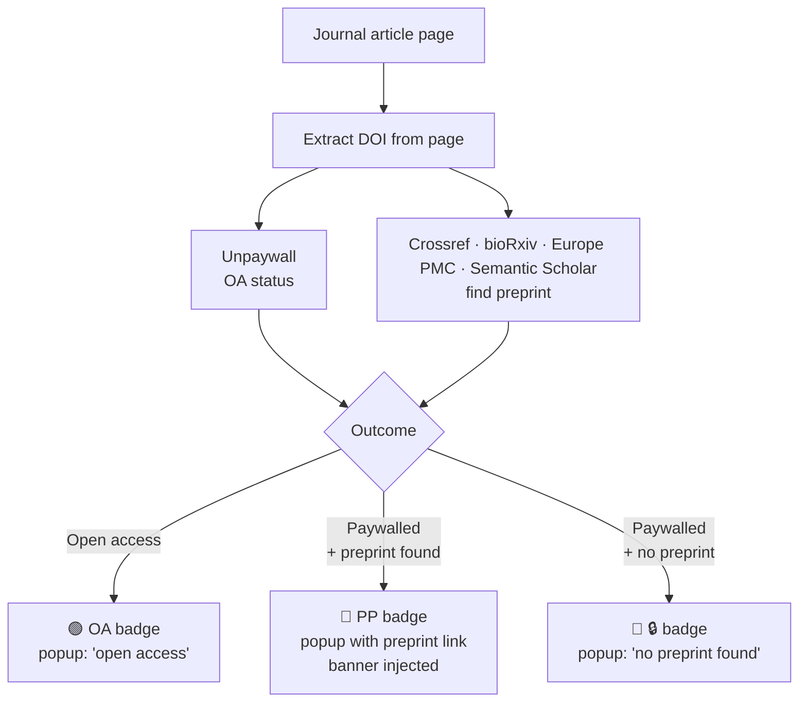

# Find Preprint

Chrome extension that detects whether a journal article you're viewing is open
access, and if not, finds a freely available preprint version (bioRxiv,
medRxiv, arXiv, ChemRxiv, Research Square, etc.).

## How it works

1. A content script extracts the article's DOI from page metadata.
2. The service worker queries an API chain in order of confidence:
   1. **Unpaywall** — OA status + any preprint URLs in `oa_locations`.
   2. **Crossref** — `is-preprint-of` / `has-preprint` relations.
   3. **bioRxiv / medRxiv** — direct published-DOI to preprint-DOI lookup.
   4. **Europe PMC** — `fullTextUrlList` and preprint comment-correction links
      (resolves `PPR####` internal ids to the real preprint DOI).
   5. **Semantic Scholar** — surfaces ArXiv ids when present.
   6. **Title fuzzy search** — Crossref `posted-content` filter, only accepted
      at Jaccard similarity > 0.85, marked "likely match".
3. Results are cached in IndexedDB for 30 days, keyed by DOI.
4. The extension badge shows OA / PP / 🔒 based on the result.
5. If the page is paywalled and a preprint was found, a slim banner is
   injected at the top of the page (dismissible per-domain for 30 days).

### Flow



### Badge states

| Badge | Meaning |
| --- | --- |
| `OA` (green) | Open access — no paywall |
| `PP` (blue) | Paywalled, preprint found |
| `🔒` (red) | Paywalled, no preprint found |
| empty | No article detected on this page |

## Install (developer mode)

1. Open `chrome://extensions`.
2. Enable "Developer mode" (top right).
3. Click "Load unpacked" and select this folder.
4. The Find Preprint icon should appear in the toolbar.

## Test pages to try

Open these and watch the badge:

- Paywalled, preprint exists on Research Square:
  https://www.nature.com/articles/s41593-026-02272-6
- Open access (no preprint linked):
  https://elifesciences.org/articles/76577
- Open access with preprint (bonus link):
  https://elifesciences.org/articles/98992
- arXiv-backed CS paper on a publisher site:
  https://dl.acm.org/doi/10.1145/3442188.3445922

## Settings

Click the extension icon, then "Settings", or right-click the icon ->
"Options".

- **Unpaywall email**: defaults to `rustbioconsulting@gmail.com`. Used as a
  polite-pool contact only; not auth, no quota tied to it.
- **Banner toggle**: on by default; banner only injects when the page is
  paywalled AND a preprint was found.
- **Clear cache**: empties the 30-day IndexedDB cache.
- **Reset dismissed sites**: brings back banners on domains where you
  clicked "X".

## Privacy

- Only the DOI (or title, on title-fallback) leaves the browser, and only on
  pages where an article is detected.
- Endpoints contacted: api.unpaywall.org, api.crossref.org, api.biorxiv.org,
  www.ebi.ac.uk/europepmc, api.semanticscholar.org.
- No analytics, no telemetry, no user identifier.

## Layout

```
manifest.json
src/
  background.js          service worker, API chain, badge, per-tab result
  content_script.js      DOI extraction + banner injection
  popup.html/.css/.js    toolbar popup UI
  options.html/.js       settings page
  banner.css             injected banner styles
  lib/
    doi_extractor.js     meta-tag / JSON-LD / URL DOI extraction
    cache.js             IndexedDB 30-day cache
    preprint_hosts.js    known preprint server list + url classifier
    api_unpaywall.js
    api_crossref.js
    api_biorxiv.js
    api_europepmc.js
    api_semanticscholar.js
    api_titlesearch.js
icons/                   placeholder PP icons (replace before publish)
```

## Status

v0.1 scaffold. Works end-to-end, but icons are placeholders and the
extension hasn't been packaged for the Chrome Web Store yet.
See `PLAN.md` for milestones M1–M7 and the done definition.
